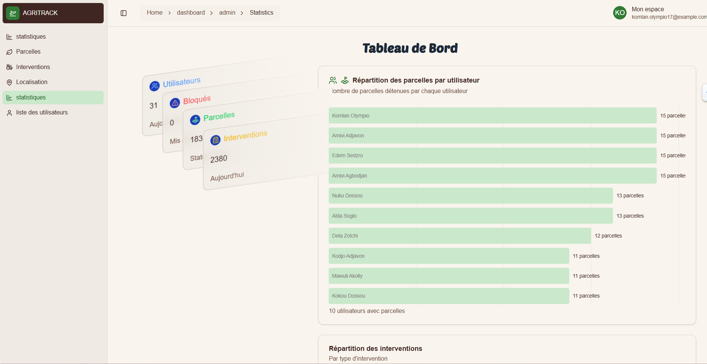

<p align="center">
  
</p>

<h1 align="center">🌾 AgriTrack API</h1>

<p align="center">
  API Laravel 12 pour la gestion des activités agricoles : parcelles, cultures, interventions, utilisateurs et plus.
</p>

---

## 🚀 À propos

AgriTrack est une plateforme de gestion agricole qui permet aux utilisateurs de gérer leurs terres, de suivre les interventions agricoles, de collaborer avec des travailleurs et d'analyser les performances grâce à des tableaux de bord.

Cette API est développée avec **Laravel 12** et conteneurisée avec **Docker** pour faciliter le déploiement et le développement. L'authentification est assurée par **Laravel Sanctum**.

---

## 🧪 Technologies utilisées

- Laravel 12
- PHP 8.3+
- MySQL
- NGINX (configuration dans `docker/`)
- Docker & Docker Compose
- Laravel Sanctum

---

## ⚙️ Démarrage rapide avec Docker

### 1. Cloner le projet

```bash
git clone https://github.com/votre-utilisateur/AgriTrack-Backend.git
cd AgriTrack-Backend
```

### 2. Configurer l'environnement

```bash
cp .env.example .env
```

Éditez le fichier `.env` pour configurer les variables de base de données :
```env
DB_CONNECTION=mysql
DB_HOST=db
DB_PORT=3306
DB_DATABASE=laravel
DB_USERNAME=root
DB_PASSWORD=rootpassword
```

### 3. Démarrer les conteneurs

```bash
docker-compose up -d --build
```

### 4. Installer les dépendances et configurer l'application

```bash
docker exec -it laravel_app composer install
docker exec -it laravel_app php artisan key:generate
docker exec -it laravel_app php artisan storage:link
```

### 5. Exécuter les migrations et les seeders

```bash
docker exec -it laravel_app php artisan migrate --seed
```

---

## 🌱 Accès aux services

- **API** : http://localhost:8000
- **PHPMyAdmin** : http://localhost:8080
  - Serveur: `db`
  - Utilisateur: `root`
  - Mot de passe: `rootpassword`

---

## 🛠 Commandes Docker utiles

| Commande | Description |
|----------|-------------|
| `docker-compose up -d` | Démarrer les conteneurs en arrière-plan |
| `docker-compose down` | Arrêter les conteneurs |
| `docker exec -it laravel_app bash` | Accéder au conteneur de l'application |
| `docker-compose logs -f` | Voir les logs en temps réel |

---

## 🌱 Données de test

Le seeder inclut :
- 1 utilisateur admin (`admin@agritrack.com` / mot de passe : `password`)
- 10 parcelles fictives
- 20 cultures associées
- 50 interventions aléatoires

Voici les commandes pour gérer les seeders **avec et sans Docker** :

---

## 🌱 **Avec Docker** (pour votre configuration)

### 1. Exécuter tous les seeders (après migrations)
```bash
docker exec -it laravel_app php artisan db:seed
```

### 2. Exécuter un seeder spécifique
```bash
docker exec -it laravel_app php artisan db:seed --class=UserSeeder
```

### 3. Réinitialiser complètement la base (DROP + recréer + seed)
```bash
docker exec -it laravel_app php artisan migrate:fresh --seed
```

### 4. Lister les seeders disponibles
```bash
docker exec -it laravel_app php artisan db:seed --list
```

---

## 💻 **Sans Docker** (installation locale)

### 1. Exécuter tous les seeders
```bash
php artisan db:seed
```

### 2. Exécuter un seeder spécifique
```bash
php artisan db:seed --class=UserSeeder
```

### 3. Réinitialiser complètement la base
```bash
php artisan migrate:fresh --seed
```

### 4. Générer un nouveau seeder
```bash
php artisan make:seeder NouveauSeeder
```

---

## 🔄 **Commandes communes aux deux méthodes**

| Action | Docker | Sans Docker |
|--------|--------|-------------|
| Lancer les seeders | `docker exec -it laravel_app php artisan db:seed` | `php artisan db:seed` |
| Seed spécifique | `docker exec -it laravel_app php artisan db:seed --class=X` | `php artisan db:seed --class=X` |
| Reset complet | `docker exec -it laravel_app php artisan migrate:fresh --seed` | `php artisan migrate:fresh --seed` |
| Créer un seeder | `docker exec -it laravel_app php artisan make:seeder X` | `php artisan make:seeder X` |

---

## 📦 **Seeders par défaut dans AgriTrack**
1. `DatabaseSeeder` (parent)
2. `UserSeeder` (admin@agritrack.com / password)
3. `ParcelleSeeder` (10 parcelles)
4. `CultureSeeder` (20 cultures)
5. `InterventionSeeder` (50 interventions)

---

## ⚠️ **Attention**
- Avec Docker, assurez-vous que les conteneurs sont en marche (`docker-compose ps`)
- Sans Docker, vérifiez que `.env` est bien configuré pour votre base de données locale


---

## 🔍 Structure des conteneurs

| Service | Nom du conteneur | Port | Description |
|---------|-----------------|------|-------------|
| App | `laravel_app` | - | Conteneur PHP/Laravel |
| Web | `laravel_webserver` | 8000 | Serveur Nginx |
| DB | `laravel_db` | 3306 | Base de données MySQL |
| PHPMyAdmin | `laravel_phpmyadmin` | 8080 | Interface d'administration MySQL |

---

## 🚨 Dépannage

Si vous rencontrez des problèmes :
1. Vérifiez que les ports 8000 et 8080 sont libres
2. Relancez les conteneurs avec `docker-compose down && docker-compose up -d`
3. Consultez les logs avec `docker-compose logs`

---

